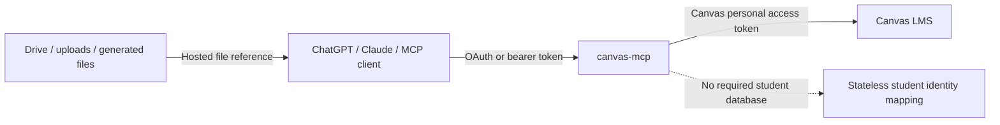

<div align="center">

# canvas-mcp

**A self hosted MCP server for Canvas LMS.**

Connect ChatGPT, Claude, or another MCP client to your own Canvas account for courses, assignments, grades, files, discussions, submissions, teacher workflows, and more.

[](https://github.com/caleb-mau/canvas-mcp/actions/workflows/ci.yml)
[](LICENSE)
[](package.json)
[](https://modelcontextprotocol.io/)

[Deploy to Vercel](#deploy-to-vercel) · [Run locally](#run-locally) · [Privacy](PRIVACY.md) · [Security](SECURITY.md) · [Contributing](CONTRIBUTING.md)

</div>

## Why this exists

Canvas has a large API, but most AI clients cannot use it directly.

canvas-mcp gives an MCP client a controlled bridge to a Canvas account using a personal Canvas access token. It works locally over stdio or remotely over Streamable HTTP.

The project is intentionally self hosted. There is no required account database, no hosted user system, and no Canvas OAuth requirement for the normal setup.

## Highlights

| Capability | Included |
| --- | :---: |
| Courses, assignments, grades, modules, pages | ✅ |
| Full module reading and module item content resolution | ✅ |
| Submission history and recently graded work | ✅ |
| Text, URL, and file submissions | ✅ |
| Discussions and Canvas Inbox | ✅ |
| Announcements, planner, calendar, activity stream | ✅ |
| Course file listing and downloads | ✅ |
| Teacher grading and messaging tools | ✅ |
| Teacher identity pseudonymization | ✅ |
| Generic Canvas REST escape hatch | ✅ |
| Local stdio transport | ✅ |
| Remote MCP endpoint for Vercel and similar hosts | ✅ |
| ChatGPT OAuth compatibility | ✅ |
| Hosted file handoff from Drive, uploads, generated files, and other compatible sources | ✅ |
| Database required | ❌ |

## Safety model

**Drafting is not submitting.**

Reading an assignment, solving it, drafting an answer, rewriting it, or reviewing it does not submit anything to Canvas.

Submission and other consequential tools are separately exposed as write tools and carry MCP annotations such as `destructiveHint` so capable hosts can show their native approval UI before execution.

Those annotations are not the authorization boundary. Canvas permissions and the configured write mode are still enforced by the server.

## Write modes

| Mode | Intended use | Writes |
| --- | --- | --- |
| `read_only` | Research and review | None |
| `student` | Normal student workflow | Submissions, discussions, Inbox, module progress |
| `teacher` | Course level teacher workflow | Grading, comments, messaging, course actions |
| `full` | Advanced unrestricted Canvas API use | Anything permitted by the Canvas token |

Teacher mode also pseudonymizes known student identity fields before data reaches the model. See [PRIVACY.md](PRIVACY.md) for the exact boundaries and limitations.

## Deploy to Vercel

The fastest remote setup is a normal Vercel deployment.

[](https://vercel.com/new/clone?repository-url=https%3A%2F%2Fgithub.com%2Fcaleb-mau%2Fcanvas-mcp&env=CANVAS_BASE_URL%2CCANVAS_ACCESS_TOKEN%2CMCP_AUTH_TOKEN%2CCANVAS_WRITE_MODE)

Set these environment variables:

| Variable | Required | Purpose |
| --- | :---: | --- |
| `CANVAS_BASE_URL` | ✅ | Your Canvas origin, for example `https://school.instructure.com` |
| `CANVAS_ACCESS_TOKEN` | ✅ | Personal access token created inside Canvas |
| `MCP_AUTH_TOKEN` | ✅ remote | Secret used to protect the remote MCP endpoint and authorize ChatGPT |
| `CANVAS_WRITE_MODE` |  | `student` by default |
| `CANVAS_REDACTION_KEY` |  | Optional dedicated secret for teacher pseudonyms |
| `CANVAS_MAX_PAGES` |  | Maximum Canvas pagination pages per call, default `20` |
| `CANVAS_TIMEOUT_MS` |  | Request timeout, default `30000` |
| `CANVAS_MAX_REMOTE_FILE_MB` |  | Maximum hosted file download size, default `50` |
| `CANVAS_MAX_VIDEO_MB` |  | Maximum explicitly requested module video size, default `250` |
| `VIDEO_DOWNLOAD_SECRET` |  | Optional separate HMAC secret for short lived video links |
| `YTDLP_BINARY_PATH` |  | Optional path to an installed yt-dlp executable |

Your remote MCP endpoint is:

```text
https://your-deployment.example/mcp
```

### ChatGPT

ChatGPT can use the built in OAuth 2.1 compatibility flow. Canvas authentication itself still uses the private `CANVAS_ACCESS_TOKEN` stored on your deployment.

Add your `/mcp` URL in ChatGPT and use OAuth. When the authorization page opens, enter the same `MCP_AUTH_TOKEN` configured on the deployment.

<details>
<summary><strong>ChatGPT OAuth advanced settings</strong></summary>

Use these values if ChatGPT shows the advanced OAuth screen:

| Setting | Value |
| --- | --- |
| Registration method | Client Identifier Metadata Document, CIMD |
| Callback URL | `https://chatgpt.com/connector_platform_oauth_redirect` |
| CIMD URL | `https://chatgpt.com/oauth/client.json` |
| Default scopes | `mcp`, `offline_access` |
| Base scopes | Leave empty |
| Auth URL | `https://YOUR_DEPLOYMENT/oauth/authorize` |
| Token URL | `https://YOUR_DEPLOYMENT/oauth/token` |
| Registration URL | Leave empty |
| Authorization server base | Your deployment origin |
| Resource | Your deployment origin |
| OIDC | Disabled |

The DCR warning is expected because this project uses CIMD rather than Dynamic Client Registration.

</details>

### Other remote MCP clients

Clients that support a bearer token can authenticate directly:

```text
Authorization: Bearer YOUR_MCP_AUTH_TOKEN
```

## Get a Canvas access token

Inside Canvas:

1. Open **Account**
2. Open **Settings**
3. Find **Approved Integrations**
4. Choose **New Access Token**
5. Create a token and copy it

Use the normal Canvas origin as `CANVAS_BASE_URL`.

```text
https://school.instructure.com
```

Do not include page paths such as `/profile/settings`.

Treat the Canvas access token like a password.

## Run locally

Requirements:

* Node.js 20 or newer
* npm

```bash
git clone https://github.com/caleb-mau/canvas-mcp.git
cd canvas-mcp
npm install
npm run setup
```

Optional browser based local setup:

```bash
npm run setup:web
```

Example stdio MCP configuration:

```json
{
  "mcpServers": {
    "canvas": {
      "command": "npm",
      "args": ["run", "start:stdio", "--silent"],
      "cwd": "/absolute/path/to/canvas-mcp"
    }
  }
}
```

## Module first courses

Some Canvas courses are organized primarily through **Modules** rather than the Assignments page. canvas-mcp treats modules as first class course content.

Module tools can:

* List modules in course order
* Get one module and its completion or lock state
* List every module item in order
* Get one module item with completion requirements and content details
* Resolve a module item into its underlying Canvas content
* Read an entire module end to end
* Find the previous and next item in the teacher's module sequence
* Mark supported module items read, done, or not done

`canvas_get_module_item_content` and `canvas_read_module` understand Canvas module item types such as pages, files, assignments, quizzes, discussions, subheaders, external URLs, and external tools.

For Canvas hosted content, the MCP follows the linked Canvas API object. That means a module page can return its actual page body, an assignment can include the current submission, and a file can return its Canvas metadata.

External URLs and external tools are returned as targets but are not automatically browsed.

Example requests include:

```text
What do I need to do in Unit 4?
Read everything my teacher put in the Week 7 module.
What comes after this page in the module?
Which module items are still incomplete?
```

## Module video downloads

Module reading never downloads video bytes automatically.

When module content contains a supported public video URL, module content results expose a `video_urls` list. This can detect common YouTube and Vimeo links as well as direct media URLs found in Canvas page or module content.

If the user explicitly asks for the video file, `canvas_download_module_video`:

1. Re-fetches the requested Canvas module item
2. Resolves its linked Canvas content
3. Verifies the selected video URL actually appears in that module item
4. Creates a short lived signed file link
5. Downloads or streams the media only when the client opens that link

YouTube and similar public video pages use `yt-dlp` when a direct MP4 is not available. The server does not pass Canvas credentials, cookies, browser sessions, or login data to yt-dlp, and it does not attempt to bypass DRM.

On Vercel Linux x64, canvas-mcp can bootstrap the pinned official yt-dlp standalone binary into ephemeral `/tmp` storage on the first explicit video request. The binary is SHA 256 verified before execution. Other hosts can provide an existing binary with `YTDLP_BINARY_PATH`.

Video download links are stateless HMAC signed URLs with a ten minute lifetime. No download database or media cache is required.

Environment options:

| Variable | Default | Purpose |
| --- | --- | --- |
| `CANVAS_MAX_VIDEO_MB` | `250` | Maximum explicitly requested video size |
| `VIDEO_DOWNLOAD_SECRET` | `MCP_AUTH_TOKEN` | Optional separate signing secret |
| `YTDLP_BINARY_PATH` | automatic | Path to an installed yt-dlp binary |

Only download media you are authorized to access and save. Site terms and copyright rules still apply.

## File submissions

Hosted and local files use separate tools on purpose.

### Hosted files

`canvas_submit_file` accepts a client supplied file reference. In ChatGPT, the tool uses:

```text
_meta["openai/fileParams"] = ["file"]
```

That lets compatible clients hand canvas-mcp a file from Google Drive, another connector, a user upload, or a generated file without requiring provider specific code.

The runtime file object contains:

```json
{
  "download_url": "https://temporary-file-url.example/...",
  "file_id": "file_...",
  "mime_type": "application/pdf",
  "file_name": "essay.pdf"
}
```

canvas-mcp securely downloads the bytes, performs Canvas's official file upload flow, then submits the Canvas file ID.

Remote file URLs must use HTTPS. Localhost and private network targets are rejected, redirects are revalidated, download size is limited, and Canvas credentials are never forwarded to the file source.

### Local files

`canvas_submit_local_file` accepts a filesystem path and is intended for local stdio clients.

## Teacher privacy

Teacher mode is designed for **FERPA conscious workflows**, not as a blanket claim of FERPA compliance.

Known student names, emails, login IDs, SIS IDs, avatar URLs, and raw Canvas user IDs are replaced or removed where recognized. Students are represented with stable course scoped references such as:

```text
student_R7K4Q2M8PZ
```

The mapping is not stored in a database. It is derived with HMAC and resolved against the live Canvas roster only when an action needs the real Canvas user ID.

The default teacher roster also minimizes data. Grades and activity history are omitted unless explicitly requested.

Read [PRIVACY.md](PRIVACY.md) before using real education records.

## Architecture



Canvas remains the source of truth for courses, rosters, assignments, submissions, and grades.

## Canvas API coverage

Dedicated tools cover the most common workflows. For endpoints that do not have a dedicated tool, `canvas_api` can call same origin Canvas REST endpoints directly.

Mutating raw API calls still obey the configured write mode and are advertised as consequential writes.

## Security

The project includes controls for:

* Same origin Canvas credential forwarding
* HTTPS only hosted file downloads
* Private network and localhost SSRF blocking
* Redirect validation
* Remote file size limits
* No application payload logging by design
* `Cache-Control: no-store` on hosted MCP responses
* Teacher identity pseudonymization
* OAuth PKCE and resource binding

Read [SECURITY.md](SECURITY.md) for reporting and deployment guidance.

## Development

```bash
npm install
npm test
npm run typecheck
npm run build
```

Please use fictional data in tests. Never commit real Canvas tokens or student records.

See [CONTRIBUTING.md](CONTRIBUTING.md) before opening a pull request.

## Status

This project is still early and intentionally small. Expect Canvas edge cases and district specific behavior. Bug reports with sanitized reproduction details are welcome.

## License

MIT. See [LICENSE](LICENSE).
